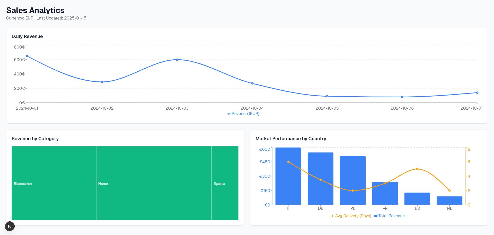

# Zadanie rekrutacyjne — Data Visualization (Frontend)

## Uruchomienie projektu
```bash
git clone https://github.com/blacklabel/data-viz-frontend.git
npm install
npm run dev
```

Projekt będzie dostępny pod adresem http://localhost:3000

## Opis rozwiązania
Wybrałem intuicyjne i proste do zrozumienia wykresy, obrazujące:
 - dzienny przychód firmy i ilość zamówień
 - mapę drzewa do ilustracji przychodu z poszczególnych kategorii (jest ich tu dość mało ale na większej ilości danych, pasowałby on idealnie)
 - wykres do zobrazowania przychodu z konkretnych krajów

Do strony użyłem react wraz z next.js, a do ilustracji danych wykorzystałem bibliotekę recharts.

Tekst w sekcji przychodu jest nieostry, co według mnie wynika z tego, że korzystam z linxua. Na stronie dewelopera wygląda to identycznie.


